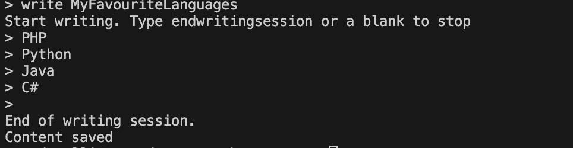
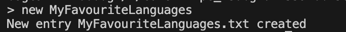
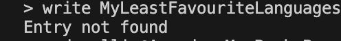
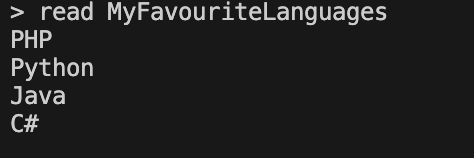
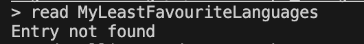

# Journal
The most basic command-line journal written in using .NET 8.

Created for the sole purpose of using the Singleton pattern.

## How to setup this project
Refer to the following to install and run dotnet for development: https://dotnet.microsoft.com/en-us/learn/dotnet/hello-world-tutorial/install

Not for development:
1. Install dotnet: https://dotnet.microsoft.com/en-us/learn/dotnet/hello-world-tutorial/install. Ignore the vscode section.
2. Check if dotnet is installed by running "dotnet"
3. Do: dotnet run inside the project directory.

## Create an entry
```
new <name of entry>
```



## Write to an entry
```
write <name of existing entry>
```



### Writing to a non-existent entry


## Read an entry
```
read <name of existing entry>
```



### Reading a non-existent entry

